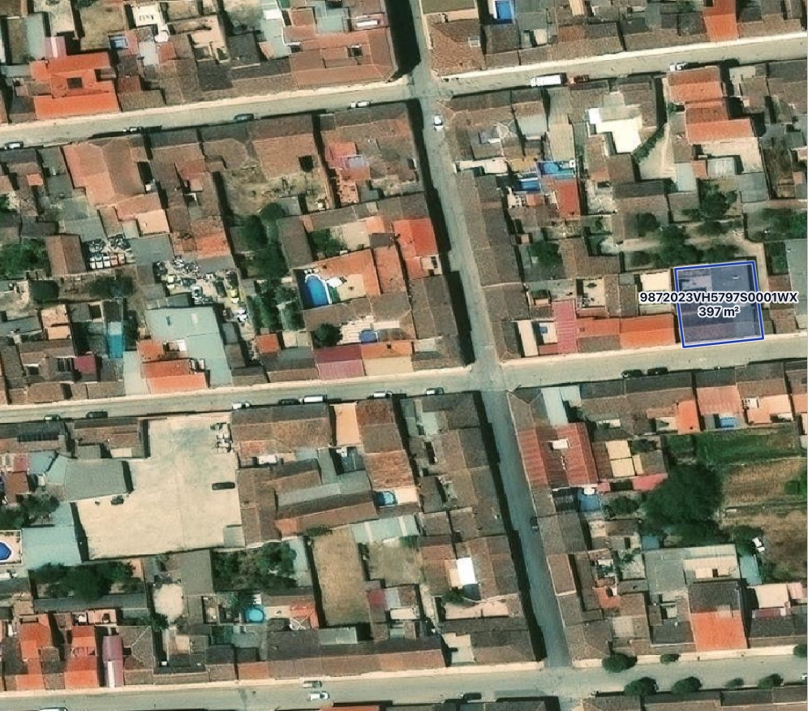
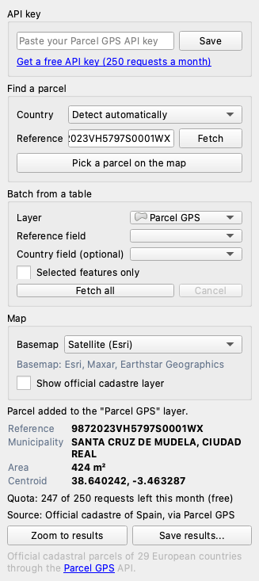

# Parcel GPS for QGIS: cadastral parcels of Europe

A QGIS plugin that adds **official cadastral parcels from 29 European countries** to your map as
polygons, with their reference, country, area, municipality and source. It uses the
[Parcel GPS API](https://www.parcelgps.com/developers).



*Real result in QGIS 4.2. Imagery: Esri, Maxar, Earthstar Geographics.*

- **By reference**: type a cadastral reference (the country is detected, or pick it).
- **On the map**: click anywhere and get the parcel under the cursor, in any project CRS.
- **In batch**: choose a table (CSV, spreadsheet, any layer) and the field that holds the references,
  plus an optional country field. A progress bar shows the run, which you can cancel. Per-minute
  rate limits (HTTP 429) are handled by waiting and retrying. If your monthly quota runs out, the
  run stops cleanly and tells you so.
- Every result goes into one memory layer, **"Parcel GPS"** (EPSG:4326, MultiPolygon), with the fields
  `reference`, `country`, `area_m2`, `municipality`, `province`, `address`, `latitude`, `longitude`,
  `source` and `fetched_at`. Save it as GeoPackage, GeoJSON, Shapefile or KML with **Save results...**,
  or with *Make Permanent* in QGIS.
- **Ready to read**: when the project has no basemap yet, the first result adds one under the
  parcels: satellite imagery (Esri World Imagery) by default, or OpenStreetMap, or none, chosen in the
  **Map** box of the panel and remembered. The map switches to Web Mercator (EPSG:3857) and frames
  the parcel with a margin. If your project already has a basemap or any raster layer, nothing is
  added. Parcels are drawn in translucent blue with a strong outline and labelled with their
  reference and area (m² below one hectare, ha above), with a halo that keeps them legible over
  imagery. The panel shows the reference, municipality, area and centroid of the last parcel.
- **Official cadastre on top (Spain)**: for Spanish results, tick **Show official cadastre layer** to
  add the Catastro INSPIRE WMS (`CP.CadastralParcel`) and see the neighbouring parcels. It is off by
  default.
- Clear messages for a bad API key, an exhausted quota, rate limits, countries without coverage and
  ambiguous references.
- The interface is in English, Spanish, French, German and Italian, following your QGIS language.



## Coverage

29 European countries: Spain (with the Basque Country and Navarre foral cadastres), Portugal,
France, Italy, Germany, Austria, Switzerland, Liechtenstein, Belgium, the Netherlands, Luxembourg,
Poland, Czechia, Slovakia, Slovenia, Croatia, Bulgaria, Greece, Cyprus, Denmark, Sweden, Norway,
Finland, Iceland, Estonia, Latvia, Lithuania, Ireland and the United Kingdom (Scotland). You can search
by reference in 27 of them and by clicking on the map in all 29. In Croatia and the UK the API
works by coordinates only.

The data comes from the official cadastre of each country. The `source` field and the panel show the
attribution that the API returns.

## Basemaps and attribution

| Option | Source | Attribution |
|---|---|---|
| Satellite (default) | Esri World Imagery | Esri, Maxar, Earthstar Geographics |
| Street map | OpenStreetMap standard tiles | © OpenStreetMap contributors |
| Official cadastre (Spain, optional overlay) | Dirección General del Catastro, INSPIRE WMS | Dirección General del Catastro |

The attribution is stored in each layer's metadata and shown in the panel. Tiles are fetched only for
the area you are looking at, through the QGIS network stack and its cache; the plugin never
downloads tiles in bulk, in line with the
[OpenStreetMap tile usage policy](https://operations.osmfoundation.org/policies/tiles/).

## Get an API key

The plugin needs a Parcel GPS API key. **The free plan gives 250 requests a month**, and failed
lookups are not charged. Paid plans start at 19 EUR a month, and there is an Enterprise plan for
larger volumes.

Get a key at **https://www.parcelgps.com/developers**, paste it in the panel and click **Save**.
The key is stored in your QGIS user settings and never written to the log.

A lookup by reference costs one request. A click on the map can cost two (point to reference, then
the parcel). When the first answer has no outline, one more request fetches it. Each key also has a
per-minute limit (10 a minute on the free plan, 60 to 300 on paid plans), so large batches on a free
key take a while: the plugin waits and carries on by itself.

## Install

**From QGIS** (once it is published): *Plugins > Manage and Install Plugins*, search for
"Parcel GPS" and click *Install*.

**From a zip**: download `parcel_gps-<version>.zip` from the
[releases page](https://github.com/TheHiddenPandaDev/qgis-parcel-gps/releases), then in QGIS go to
*Plugins > Manage and Install Plugins > Install from ZIP*.

Works on QGIS 3.22 or later and on QGIS 4 (Qt6). No extra Python packages are needed. Requests go through the QGIS
network stack, so your proxy and SSL settings apply.

## Use

1. Open the panel from the **Parcel GPS** toolbar button or *Web > Parcel GPS*.
2. Paste your API key and click **Save**.
3. Type a reference such as `9872023VH5797S0001WX` and press **Fetch**, or click
   **Pick a parcel on the map** and click on the map.
4. For a batch, choose the layer and the reference field (and a country field if your list mixes
   countries), then click **Fetch all**. Batches larger than 25 references ask for confirmation first.

## Development

```bash
pip install pytest pytest-cov
python -m pytest                    # tests and coverage for parcel_gps/core
python scripts/build_translations.py  # needs lrelease (pip install pyside6-essentials)
python scripts/build_zip.py         # dist/parcel_gps-<version>.zip, ready for plugins.qgis.org
```

`parcel_gps/core` has no QGIS imports: it holds the API client, response parsing, batch runner,
error mapping and the presentation rules (style, label expression, area format, basemap catalogue and
detection), and it is fully covered by tests. The QGIS side (`dock.py`, `fetch_task.py`,
`results_layer.py`, `map_style.py`, `basemap.py`, `qgis_transport.py`) builds the panel, runs requests
in a `QgsTask`, writes and styles the layer and adds the basemap.

## Licence

GPL-2.0-or-later. See [LICENSE](LICENSE).

Made by [The Hidden Panda](https://www.parcelgps.com). Issues and ideas:
https://github.com/TheHiddenPandaDev/qgis-parcel-gps/issues
